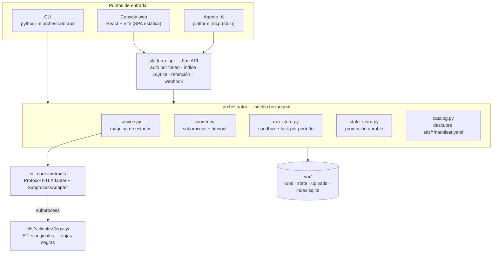

# ETL Suite Agéntica — Dossier de despliegue en la nube

**Audiencia:** Líder Técnico y Arquitecto de Software.
**Objetivo:** que puedan decidir *dónde* y *cómo* desplegar esta plataforma sin leer el código.
**Estado del repo al escribir esto:** rama `main`, 284 tests verdes, CI en Bitbucket Pipelines sobre Linux/Python 3.12.

> **Veredicto en una línea:** la aplicación está lista para nube, pero es **stateful y de instancia única por diseño**.
> El camino de menor riesgo es **un contenedor Linux, una sola réplica, con disco de bloques persistente** detrás de un reverse proxy.
> Serverless por request (Cloud Run / Functions / Lambda) **no sirve tal cual**, y explicamos por qué abajo.

---

## Índice

1. [Qué es este sistema](#1-qué-es-este-sistema)
2. [Ruta de lectura sugerida](#2-ruta-de-lectura-sugerida)
3. [Arquitectura](#3-arquitectura)
4. [Superficie desplegable](#4-superficie-desplegable)
5. [Perfil de ejecución: lo que condiciona el deploy](#5-perfil-de-ejecución-lo-que-condiciona-el-deploy)
6. [Requisitos de infraestructura](#6-requisitos-de-infraestructura)
7. [Bloqueantes antes de salir a producción](#7-bloqueantes-antes-de-salir-a-producción)
8. [Opciones de despliegue comparadas](#8-opciones-de-despliegue-comparadas)
9. [Seguridad, datos y cumplimiento](#9-seguridad-datos-y-cumplimiento)
10. [Observabilidad y operación](#10-observabilidad-y-operación)
11. [Configuración por variables de entorno](#11-configuración-por-variables-de-entorno)
12. [CI/CD: qué hay y qué falta](#12-cicd-qué-hay-y-qué-falta)
13. [Preguntas abiertas para Infraestructura](#13-preguntas-abiertas-para-infraestructura)
14. [Referencias en el repositorio](#14-referencias-en-el-repositorio)

---

## 1. Qué es este sistema

Es una **capa de ejecución controlada** sobre ETLs legacy de cobranza de Evoltis. No reescribe los ETLs:
los envuelve como procesos invocables y les agrega lo que no tenían — aislamiento, evidencia y control.

Cada corrida:

1. Recibe archivos de entrada (Excel/CSV/TXT) desde la consola web, la CLI o un agente vía MCP.
2. Se ejecuta en un **sandbox propio en disco**, con `cwd` controlado y timeout.
3. Deja **evidencia forense**: hash SHA-256 de cada input, stdout/stderr, exit code, inventario de artefactos, `run.json`.
4. Valida **postcondiciones de salida** (no confía en el exit code) y, si el ETL tiene estado mensual, lo **promociona de forma durable**.

**Volumen operativo actual:** 15 ETLs ejecutables de 8 clientes (Naranja X, Bancor, EPEC, Frávega, Claro Uruguay,
Encuesta CX, Social Learning AR/CL, Petersen). Otros 7 están declarados en el catálogo pero inertes
(`executable: false`) esperando credenciales de la API de Retell.ai. Cada ETL corre **una vez por día hábil**,
disparado manualmente por el equipo de operaciones antes de un deadline.

**Esto no es un pipeline de big data.** Es baja frecuencia, alta criticidad y trazabilidad exigida.

---

## 2. Ruta de lectura sugerida

| Si sos… | Empezá por | Y después mirá |
|---|---|---|
| Líder Técnico | §5 (perfil de ejecución) y §7 (bloqueantes) | §12 (CI/CD) |
| Arquitecto | §3 (arquitectura) y §8 (opciones) | §9 (datos y cumplimiento) |
| Infra / DevOps | §6 (requisitos) y §11 (configuración) | §13 (preguntas abiertas) |

Todo lo afirmado abajo está referenciado con `archivo:línea`. Si algo no cierra, el código es la fuente de verdad.

---

## 3. Arquitectura

### 3.1 Capas



### 3.2 Anatomía de una corrida en disco

```
var/runs/<etl_id>/<timestamp>_<uuid>/
├── input/       inputs copiados, con hash SHA-256 registrado
├── output/      artefactos generados por el legacy
├── logs/        stdout.log, stderr.log y logs del legacy
├── state/       estado persistente puesto a disposición del legacy
├── processed/   archivos que el legacy marca como procesados
└── run.json     metadata completa — fuente de verdad de la corrida
```

`var/` es **el único estado del sistema**. No hay base de datos relacional: el índice SQLite
(`var/index.sqlite`) es una vista derivada y reconstruible desde los `run.json`
(`apps/etl-platform-api/platform_api/hardening.py:88` `refresh_full`).

### 3.3 Ciclo de vida

```
preparing → running → succeeded
                    → failed      (exit code no permitido, spawn fallido, postcondición incumplida)
                    → timed_out
          → blocked               (validación, lock tomado, snapshot existente, recovery pendiente)
```

### 3.4 Extensibilidad

Agregar un cliente = agregar una carpeta bajo `etls/`. El catálogo descubre `etls/*/manifest.yaml` y resuelve
el adapter por import dinámico (`modulo:Clase`). **Cero archivos del núcleo tocados.**
Esto importa para el deploy: la superficie desplegable no crece estructuralmente cuando entra un cliente nuevo,
sólo crece el contenido de la imagen.

---

## 4. Superficie desplegable

| Componente | Tecnología | Cómo se despliega | Notas |
|---|---|---|---|
| **API + orquestador** | Python 3.12, FastAPI, Uvicorn | Contenedor Linux (`Dockerfile` en la raíz) | Único proceso servidor. Ejecuta los ETLs como subprocesos hijos. |
| **Consola web** | React 18 + Vite 6 + TypeScript | Build estático (`npm run build` → `apps/etl-console/dist/`) | **La API no la sirve.** Ver §7.2. |
| **ETLs legacy** | Python puro + pandas/openpyxl | Van *dentro* de la imagen de la API | Se invocan por `subprocess`, no por import. |
| **Servidor MCP** | Python, transporte stdio | No se despliega en la nube | Corre en la máquina del agente y le pega a la API por HTTP. |

### 4.1 Sobre la imagen

`Dockerfile` actual: `python:3.12-slim`, usuario no-root `etl` (uid 1000), `pip install -e ".[etl,api,test]"`, puerto 8000.

Dos observaciones para el review:

- **Instala el extra `test` en la imagen de producción** (`Dockerfile:13`). Es peso y superficie innecesarios. Cambio trivial.
- **Es una instalación editable (`-e`) sobre el código copiado.** Funciona, pero para una imagen inmutable
  conviene instalación normal y build multi-stage.

**Verificado:** las dependencias runtime de los 15 ETLs ejecutables se cubren con el extra `etl`
(`pandas`, `openpyxl`, `email-validator`). Los `requirements.txt` de los legacy mencionan `requests`,
`python-dotenv`, `tqdm` y `customtkinter`, pero esos imports viven **sólo** en módulos de UI de escritorio
y en los caminos Retell — ninguno es alcanzado por los entrypoints que el catálogo invoca. `python:3.12-slim`
no trae Tk y eso **no** rompe nada.

---

## 5. Perfil de ejecución: lo que condiciona el deploy

Esta es la sección que decide la topología. Todo acá es comportamiento **deliberado**, no accidental.

| # | Restricción | Evidencia | Consecuencia para el deploy |
|---|---|---|---|
| **5.1** | **El trabajo ocurre en background threads, después de responder** | `POST /api/runs` devuelve `202` y encola en un `ThreadPoolExecutor` de módulo (`apps/etl-platform-api/platform_api/main.py:66`, `main.py:311`) | La instancia necesita **CPU asignada permanentemente**, no sólo durante el request. Descarta serverless por request. |
| **5.2** | **El arranque marca como `failed` toda corrida viva** | `recover_orphans` (`apps/etl-platform-api/platform_api/hardening.py:135`), invocado en `create_app` (`main.py:156`) | Con **dos réplicas sobre el mismo volumen, cada una mata las corridas en vuelo de la otra**. Es el argumento más fuerte para instancia única. También implica: rolling deploy = corridas abortadas. |
| **5.3** | **Lock por período basado en `mkdir` atómico + `os.replace` de directorios + `fsync` de directorios** | `apps/commons/orchestrator/run_store.py:93` (`acquire_lock`), `run_store.py:118` (`release_lock`), `run_store.py:14` (`_fsync_directory`) | Exige un filesystem con **semántica POSIX real**. Un disco de bloques la garantiza. NFS es aceptable con reservas; SMB y los montajes tipo FUSE sobre object storage **no**. |
| **5.4** | **Índice SQLite local** | `apps/etl-platform-api/platform_api/hardening.py:57` | Escritor único. Sobre red compartida el locking de SQLite es frágil. Refuerza instancia única + disco local. |
| **5.5** | **Concurrencia acotada a 2 corridas simultáneas** | `ETL_MAX_CONCURRENT_RUNS`, default `2` (`apps/etl-platform-api/platform_api/main.py:67`) | El dimensionado de CPU/RAM se calcula sobre este número, no sobre requests/segundo. |
| **5.6** | **Timeout de 900s por corrida** | `timeout_seconds: 900` en los 15 manifiestos; `apps/commons/orchestrator/runner.py:48` | Los timeouts de load balancer / ingress **no aplican** (el request ya respondió), pero el health check debe tolerar una instancia ocupada 15 minutos. |
| **5.7** | **`business_date` debe ser el día de hoy — regla de negocio, no deuda** | `apps/etl-platform-api/platform_api/main.py:251` usa `date.today()`; ADR-001 decisión 7 | `date.today()` es **hora local del contenedor**. Ver §7.1: es el bug de despliegue más probable. |
| **5.8** | **Los outputs llevan la fecha del sistema estampada** | `output_date_source: system_date` en los manifiestos | Mismo problema de zona horaria que 5.7, pero peor: contamina los nombres de archivo entregados al cliente. |
| **5.9** | **Los inputs se persisten a disco antes de correr** | `apps/etl-platform-api/platform_api/main.py:286` (`var/uploads/<uuid>`) | El ingress debe permitir multipart de varios MB. Verificar límites del proxy elegido. |
| **5.10** | **Búsqueda de corrida por escaneo de directorios** | `find_run` (`apps/etl-platform-api/platform_api/main.py:191`) itera `var/runs/*` | Costo O(n) por request de detalle. Con retención de 30 días es irrelevante; si suben la retención, medir. |

---

## 6. Requisitos de infraestructura

### 6.1 Cómputo

Punto de partida sugerido, con `ETL_MAX_CONCURRENT_RUNS=2`:

| Recurso | Mínimo | Recomendado | Por qué |
|---|---|---|---|
| vCPU | 2 | 2–4 | Uvicorn + hasta 2 subprocesos pandas en paralelo. |
| RAM | 2 GB | 4 GB | pandas carga los Excel enteros en memoria. El pico lo marca el archivo más grande, no la concurrencia. |
| Réplicas | **1** | **1** | Ver 5.2 y 5.4. No escalar horizontalmente sin el rediseño de §8, opción C. |

> **Acción para el equipo:** medir el pico real de RSS con el Excel de base mensual más grande de Naranja X.
> Es el único número que no puedo darles desde el código, y es el que define el sizing.

### 6.2 Almacenamiento

**Tipo:** disco de bloques persistente montado en `/app/var`. No object storage, no SMB.

**Tamaño:** cada corrida guarda inputs + outputs + logs durante `ETL_RETENTION_DAYS` (default 30).

```
disco ≈ (tamaño_medio_corrida × corridas_por_día × días_retención) × 1.5 de margen
      ≈ (tamaño_medio_corrida × 15 × 30) × 1.5
```

Con un promedio conservador de 50 MB por corrida eso da ~34 GB. **Confirmen el promedio real** antes de aprovisionar.

**Backup:** snapshot diario del volumen. El `run.json` es la evidencia auditable de cada entrega; perderlo
es perder la trazabilidad. La purga automática al arrancar (`purge_expired`, `hardening.py:161`)
borra irreversiblemente lo vencido.

### 6.3 Red

```
Internet / VPN
      │
      ▼
Reverse proxy / Ingress  ──── /        → SPA estática (apps/etl-console/dist)
                          └── /api/*   → contenedor API :8000
```

Servir SPA y API **bajo el mismo origen** es la decisión clave: elimina el problema de CORS descrito en §7.2
sin tocar código. TLS terminado en el proxy. Acceso restringido a la red corporativa o VPN — la API expone
datos personales y no tiene control de acceso por usuario (§9).

### 6.4 Secretos

Hoy sólo hay uno: `ETL_CONSOLE_TOKEN`. Cuando entren las integraciones Retell.ai se sumarán API keys por cliente.
Vayan directo a un secret manager gestionado (Azure Key Vault / AWS Secrets Manager / GCP Secret Manager) e
inyecten por variable de entorno. **No** hornear en la imagen ni versionar en el repo.

---

## 7. Bloqueantes antes de producción

Ordenados por riesgo. Los tres primeros son de código; los demás son de configuración.

### 7.1 🔴 Zona horaria del contenedor — **el más probable de morder**

`python:3.12-slim` corre en **UTC**. La API valida `business_date == date.today()` en hora local
(`apps/etl-platform-api/platform_api/main.py:251`) y los ETLs legacy estampan la fecha del sistema en los nombres de salida.

Entre las **21:00 y las 24:00 de Argentina**, un contenedor en UTC ya está en el día siguiente.
Una corrida lanzada a esa hora se rechaza con `422` o —peor— genera archivos con la fecha equivocada
y se entregan así al cliente.

**Arreglo:** `TZ=America/Argentina/Buenos_Aires` en el contenedor y `tzdata` instalado.
Definir explícitamente qué pasa con Claro Uruguay (misma UTC-3 hoy, pero es una decisión que hay que registrar).
**Esfuerzo: bajo. Prioridad: máxima.**

### 7.2 🟠 CORS fijo a localhost

`apps/etl-platform-api/platform_api/main.py:182` permite sólo `http://localhost:5173` y `http://127.0.0.1:5173`.

La SPA llama rutas **relativas** (`/api/...`, `apps/etl-console/src/api.ts`), así que **si la sirven bajo el mismo origen
que la API, CORS no se dispara y esto no bloquea**. Sólo es bloqueante si eligen dominios separados
(ej. SPA en un CDN y API en otro host).

**Arreglo:** o servir mismo-origen (cero código), o parametrizar los orígenes por variable de entorno.
**Esfuerzo: bajo. Prioridad: alta — hay que decidirlo antes de definir DNS.**

### 7.3 🟠 No hay endpoint de health

No existe `/health` ni `/ready`. El middleware de auth sólo protege rutas bajo `/api`
(`apps/etl-platform-api/platform_api/main.py:166`), así que `/docs` y `/openapi.json` **quedan públicos** y podrían usarse como
sonda — pero eso expone la superficie de la API a cualquiera que llegue al host.

**Arreglo:** agregar `GET /health` sin auth (que no toque disco, para que no falle durante una corrida pesada)
y deshabilitar `/docs` en producción.
**Esfuerzo: bajo. Prioridad: alta — sin esto no hay probe confiable.**

### 7.4 🟡 Estrategia de despliegue con corridas en vuelo

Por 5.2, cualquier reinicio marca las corridas activas como `failed` con código `orphaned`.
No hay reintento automático ni cola durable.

**Arreglo operativo (sin código):** ventana de despliegue fuera del horario de entregas, y verificar
que no haya corridas `running` antes de reiniciar. **Recreate, nunca rolling** — un rolling deploy pone
dos instancias sobre el mismo volumen y activa exactamente el escenario de 5.2.

### 7.5 🟡 Verificar límite de tamaño de request del ingress

Los archivos suben por multipart. Confirmar que el proxy elegido tolera el Excel más grande
(varios servicios gestionados cortan en 32 MB por defecto).

---

## 8. Opciones de despliegue comparadas

### Opción A — VM única con contenedor · **Recomendada para el primer despliegue**

Una VM Linux con Docker (o `docker compose`), disco de bloques montado en `/app/var`, Nginx/Caddy al frente
sirviendo la SPA y proxyando `/api`.

| | |
|---|---|
| **Cambios de código** | Sólo los de §7 (TZ, health, `/docs`) |
| **Fortalezas** | Semántica POSIX garantizada. Instancia única natural. Snapshots de disco triviales. Coste predecible y bajo. Debug directo por SSH. |
| **Debilidades** | Parcheo del SO a cargo del equipo. Recuperación ante caída de la VM es manual (mitigable con snapshots + IaC). |
| **Servicios** | Azure VM + Managed Disk · EC2 + EBS · Compute Engine + Persistent Disk |

**Por qué la recomiendo:** es la única topología donde **ninguna** de las suposiciones del código (5.2 a 5.4)
se apoya en un comportamiento del proveedor que haya que verificar. Para un sistema de baja frecuencia
y alta criticidad, esa previsibilidad vale más que la elasticidad que no necesitan.

### Opción B — Contenedor gestionado con volumen persistente

| | |
|---|---|
| **Cambios de código** | Los de §7 |
| **Configuración obligatoria** | `min=1, max=1` réplicas. CPU siempre asignada. Estrategia `Recreate`. |
| **Fortalezas** | Menos gestión de SO. Despliegue por imagen, integrable a CI. |
| **Debilidades** | **Hay que validar el filesystem** (§5.3). Azure Files sobre SMB y los montajes FUSE sobre object storage no dan las garantías que el código asume. Se pierde elasticidad igual, porque queda fijado en una réplica. |
| **Servicios** | Azure App Service for Containers + Azure Files **NFS** · ECS Fargate + EFS · Cloud Run con *CPU always allocated* + disco persistente |

**Si eligen esta opción, el criterio de aceptación es concreto:** correr los 13 tests e2e
(`pytest etls/`) *contra el volumen de red real*, no contra el disco local del build. Si `release_lock`
o la promoción de estado fallan ahí, el filesystem no sirve.

### Opción C — Rediseño para escalar horizontalmente

Cola durable (SQS/Service Bus/Pub-Sub) + workers desacoplados + object storage para artefactos +
PostgreSQL en lugar del índice SQLite + locking distribuido en vez de `mkdir`.

| | |
|---|---|
| **Cambios de código** | Sustanciales — toca `run_store`, `state_store`, `hardening` y la API |
| **Cuándo tiene sentido** | Cuando aparezca **scheduling automático** (hoy `/api/schedule` es informativo: cruza deadlines con corridas del día, pero nadie dispara nada) o cuando el volumen supere lo que una instancia procesa en la ventana de entrega |
| **Hoy** | **No lo necesitan.** 15 corridas diarias disparadas a mano no justifican el coste ni el riesgo de tocar el núcleo. |

> Mi recomendación explícita: **A ahora, B cuando la organización pida gestión por plataforma, C sólo cuando
> el scheduling automático entre en el roadmap.** No salten a C por anticipación: el núcleo hexagonal ya está
> preparado para ese cambio (los stores son inyectables por constructor), así que postergarlo no genera deuda.

---

## 9. Seguridad, datos y cumplimiento

### 9.1 Datos personales — leer antes de elegir región

`var/` contiene **PII real de deudores**: DNI, teléfonos, montos, domicilios, según el cliente.
El `Redactor` (`apps/commons/orchestrator/logging_utils.py`) enmascara secretos de entorno y rutas absolutas del host,
pero **no enmascara datos de negocio**. Los artefactos y los logs de corrida son material sensible.

Implicancias:

- **Cifrado en reposo** en el volumen y en los backups. No opcional.
- **Residencia de datos.** Hay clientes de Argentina y de **Uruguay** (Claro UY). Confirmar con Legal si
  los datos uruguayos pueden salir del país antes de fijar la región.
- **Retención.** `ETL_RETENTION_DAYS=30` purga automáticamente al arrancar. Validar que 30 días cubra
  la obligación contractual/legal de cada cliente — hoy es un único valor global para todos.
- **Los snapshots del volumen también contienen PII** y heredan las mismas obligaciones.

### 9.2 Autenticación — la brecha más grande

| Aspecto | Estado actual |
|---|---|
| Mecanismo | Un único **bearer token compartido** (`ETL_CONSOLE_TOKEN`) |
| Usuarios y roles | **No existen** |
| Auditoría de quién lanzó qué | **No existe** — `run.json` registra la corrida, no la identidad |
| Almacenamiento del token en el navegador | `localStorage` (expuesto a XSS) |
| Comportamiento sin token configurado | **Fail-closed:** `/api/*` responde `503`, salvo opt-out explícito con `ETL_AUTH_DISABLED=1` |

El fail-closed está bien resuelto. Lo que falta es identidad. Para un sistema que procesa datos de deudores
y produce entregas contractuales, **saber quién ejecutó cada corrida no es una feature, es un requisito de auditoría**.

**Recomendación:** poner un proxy de autenticación con el IdP corporativo (OIDC) delante de la API, y en una
segunda iteración propagar la identidad al `run.json`. Lo primero es infraestructura y no toca código;
lo segundo es un cambio acotado en `platform_api`.

### 9.3 Superficie de ataque

- **Ejecución de subprocesos:** `shell=False` y comando construido desde el manifiesto declarativo
  (`apps/commons/orchestrator/runner.py:66`), no desde input del usuario. Sin inyección de shell.
- **Uploads:** se valida la extensión declarada en el manifiesto (`apps/etl-platform-api/platform_api/main.py:279`), **no el contenido**.
  No hay antivirus ni verificación de tipo real. Evaluarlo si la consola se expone más allá de la VPN.
- **Rutas:** el catálogo rechaza rutas fuera del workspace (`apps/commons/orchestrator/catalog.py`).
- **`/docs` y `/openapi.json`** quedan fuera del middleware de auth (§7.3).

---

## 10. Observabilidad y operación

### 10.1 Lo que hay

- **`run.json` por corrida:** evidencia completa e inmutable. Excelente para forensia post-mortem.
- **Recuperación de huérfanas al arranque**, reportada en `GET /api/schedule` (`apps/etl-platform-api/platform_api/main.py:350`).
- **Webhook de notificación** configurable (`ETL_NOTIFY_WEBHOOK`, compatible Slack/Teams/n8n), con
  registro durable de respaldo en `var/notifications.jsonl` aunque la entrega falle.
- **Códigos de salida de CLI diferenciados:** `0` ok, `1` falló, `2` bloqueada. Útiles si más adelante
  automatizan disparos por cron.

### 10.2 Lo que falta

| Gap | Impacto | Esfuerzo |
|---|---|---|
| Sin `/health` ni `/ready` | No hay probe confiable (§7.3) | Bajo |
| Logs de aplicación no van a stdout estructurado | El agente de logs de la nube no ve nada útil; la evidencia queda sólo en disco | Medio |
| Sin métricas (Prometheus/OTel) | No hay alerta automática de "el ETL de Bancor no corrió antes de las 12:30" | Medio |
| Alertas sólo por acción manual (`notify_dev`) | Una corrida fallida a la madrugada se descubre a la mañana | Medio |
| Sin trazas distribuidas | Poco relevante hoy: es un solo proceso | — |

**Prioridad realista:** `/health` primero (bloquea el deploy), logs a stdout segundo (lo pide cualquier
plataforma gestionada), métricas y alertas cuando el sistema ya esté corriendo en la nube y el equipo
sepa qué le duele.

---

## 11. Configuración por variables de entorno

| Variable | Default | Efecto | Nota para producción |
|---|---|---|---|
| `ETL_CONSOLE_TOKEN` | — (**fail-closed**) | Token exigido en `Authorization: Bearer` o `X-Api-Token` para todo `/api/*` | **Obligatoria.** Desde secret manager. |
| `ETL_AUTH_DISABLED` | vacío | `1` desactiva la autenticación | **Nunca en producción.** El `docker-compose.yml` la setea en `1` por defecto — ese compose es sólo para desarrollo. |
| `ETL_RETENTION_DAYS` | `30` | Purga corridas terminales y uploads más viejos que N días al arrancar. `0` desactiva | Validar contra la obligación legal de cada cliente (§9.1). |
| `ETL_NOTIFY_WEBHOOK` | vacío | URL destino de `notify_dev` | Recomendada. Sin ella sólo queda el registro en disco. |
| `ETL_MAX_CONCURRENT_RUNS` | `2` | Tamaño del pool de ejecución (hilos no-daemon: las corridas en curso terminan antes del apagado) | Subirlo exige revisar el sizing de RAM (§6.1). |
| `TZ` | — (UTC) | Zona horaria del contenedor | **Obligatoria: `America/Argentina/Buenos_Aires`.** Ver §7.1. |

Arranque en producción:

```bash
uvicorn "platform_api.main:create_app" --factory --host 0.0.0.0 --port 8000
```

> `create_app()` purga retención y recupera huérfanas al construirse. Por eso **no hay instancia a nivel de
> módulo** y hay que levantar con `--factory`: un simple import no debe disparar efectos sobre el disco.
> Si el orquestador de contenedores importa el módulo para introspección, no pasa nada.

---

## 12. CI/CD: qué hay y qué falta

### Estado actual — `bitbucket-pipelines.yml`

```yaml
image: python:3.12
pipelines:
  default:
    - step:
        name: Tests (Linux, Python 3.12)
        script:
          - pip install -e ".[test,etl,api]"
          - pytest
```

**Dato relevante para el review:** `pytest` corre con `testpaths = ["tests", "etls"]`, así que la pipeline
ejecuta **también los 13 tests e2e por ETL sobre Linux**. Es evidencia empírica de que el código —desarrollado
en Windows— funciona en el runtime destino. No es una promesa: está verificado en cada push.

### Qué falta para un pipeline de despliegue

- [ ] Build y push de la imagen a un registry privado, tagueada por commit
- [ ] Job de despliegue con aprobación manual (por §7.4: la ventana de deploy importa)
- [ ] Verificación post-deploy contra `/health` (existirá tras §7.3)
- [ ] Escaneo de vulnerabilidades de la imagen (Trivy/Snyk)
- [ ] Linters en CI: el repo ya tiene caches de `ruff` y `mypy`, pero la pipeline **no los corre**

### Suite de tests como red de seguridad

284 tests. Los 13 e2e cubren un ETL cada uno de punta a punta y **son la garantía de que un cambio de
infraestructura no rompió comportamiento observable**. Si el despliegue exige tocar el núcleo, la regla del
repo (`AGENTS.md`) es: corrélos antes y después, y **no los modifiques** — si un refactor obliga a tocar un e2e,
cambiaste comportamiento, no estructura.

---

## 13. Preguntas abiertas para Infraestructura

Las que necesito responder para cerrar el diseño. Van en orden de impacto:

1. **¿Qué nube y qué región?** Condiciona §9.1 (residencia de datos uruguayos) antes que cualquier otra decisión.
2. **¿Mismo origen para SPA y API, o dominios separados?** Define si §7.2 es cero código o un cambio.
3. **¿Hay IdP corporativo (Azure AD / Google Workspace / Okta) disponible para poner delante?** Cierra la brecha de §9.2 sin tocar la aplicación.
4. **¿Cuál es la ventana de mantenimiento aceptable?** Por §7.4 el despliegue no puede ser transparente.
5. **¿RTO y RPO exigidos?** Define la frecuencia de snapshot y si hace falta IaC para recrear la VM.
6. **¿La consola se expone a internet o queda sólo en VPN?** Cambia el análisis de §9.3 sustancialmente.
7. **¿Qué retención legal aplica por cliente?** Hoy `ETL_RETENTION_DAYS` es un valor global único.

---

## 14. Referencias en el repositorio

| Documento | Qué responde |
|---|---|
| `README.md` | Cómo levantar, cómo ejecutar un ETL, conceptos del dominio |
| `docs/reference/ARQUITECTURA.md` | Capas, flujo de una corrida, contrato de adapter, convenciones de código |
| `docs/decisions/ADR-001-nucleo-hexagonal.md` | Decisiones de arquitectura, incluida la decisión 7 (`business_date == hoy`) |
| `docs/how-to/GUIA_NUEVO_CLIENTE.md` | Alta de un cliente nuevo paso a paso |
| `AGENTS.md` | Reglas duras del repo: qué no tocar y por qué |
| `openspec/` | Propuestas de cambio y especificaciones por capability |
| `etls/<cliente>/README.md` | Entradas, salidas, deadline, reglas y contacto de cada cliente |

---

## Resumen ejecutivo

**Lo bueno:** el sistema está contenedorizado, corre como no-root, tiene fail-closed en autenticación,
retención automática de PII, recuperación de corridas huérfanas, 284 tests verdes y CI que valida Linux
en cada push. El núcleo es hexagonal con dependencias inyectadas por constructor — eso lo hace adaptable
sin cirugía cuando llegue el momento de escalar.

**Lo que hay que aceptar:** es **stateful y de instancia única por diseño**. Esa no es una limitación a
corregir antes de desplegar; es la consecuencia correcta de un sistema que prioriza *no corromper el estado*
sobre *escalar*. Con 15 corridas diarias disparadas a mano, es la decisión adecuada.

**Lo que hay que arreglar sí o sí antes de producción:** zona horaria (§7.1), endpoint de health (§7.3),
y decidir el origen de la SPA (§7.2). Los tres son cambios chicos.

**Lo que hay que planificar:** identidad y auditoría por usuario (§9.2). Es la brecha más grande y no se
resuelve con infraestructura sola a largo plazo — pero un proxy OIDC delante compra tiempo sin tocar código.
